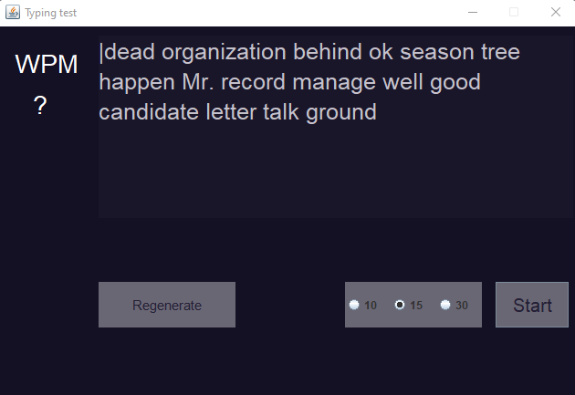

# JFrame typing speed test

___



This project is a typing speed test written in Java using JFrame.

___

## Functionality:
 
+ The "Regenerate" button, as you can guess, re-generates a text consisting of the number of words selected with the radiobutton to the right.

+ To start the test, press the "Start" button, which removes the focus from the rest of the elements.

___

## Installing:

To install, you need to create a maven project and place the repository in the java folder.

#### The following dependencies should be added to the pom.xml file:

```maven
    <dependencies>

        <dependency>
            <groupId>org.jsoup</groupId>
            <artifactId>jsoup</artifactId>
            <version>1.15.3</version>
        </dependency>

        <dependency>
            <groupId>com.googlecode.json-simple</groupId>
            <artifactId>json-simple</artifactId>
            <version>1.1.1</version>
        </dependency>

    </dependencies>
```
___

The test takes words from a JSON file with the 1000 most used words, so you either need to add it yourself to resources/json, you can find it
[here.](https://github.com/ViLsonCake/Typing-speed-test-words-json)

Or get this file by yourself using the WriteEnglishWordsToJSON class by running it. The words themselves are parsed from the 
[here.](https://gonaturalenglish.com/1000-most-common-words-in-the-english-language/)


